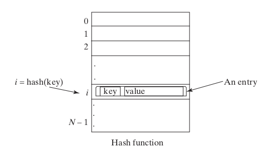
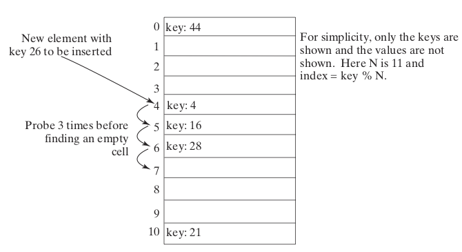
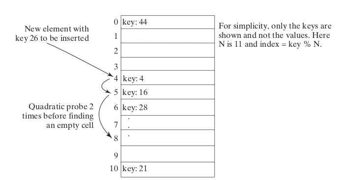
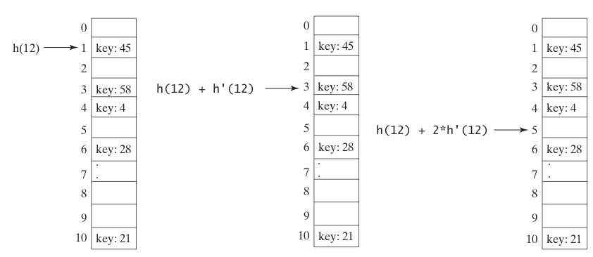
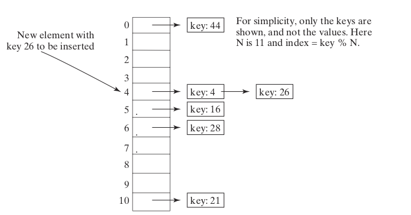
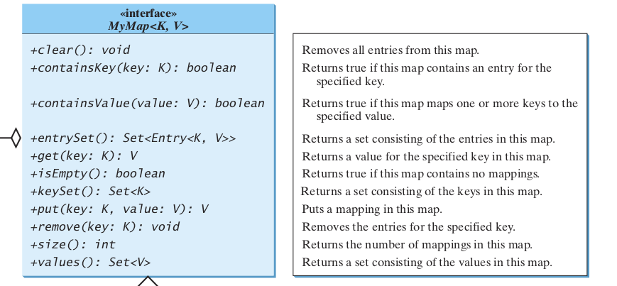
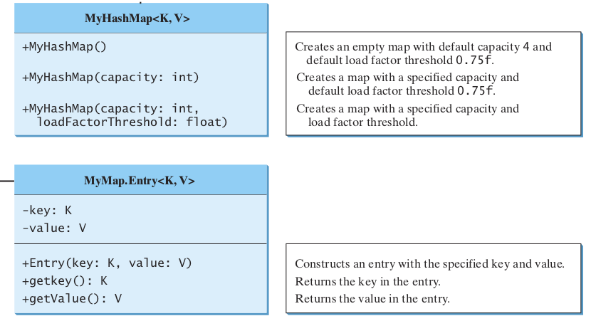
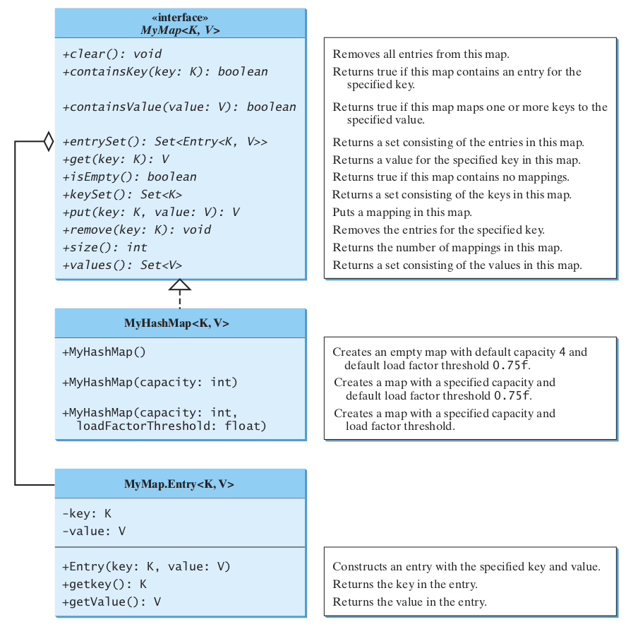
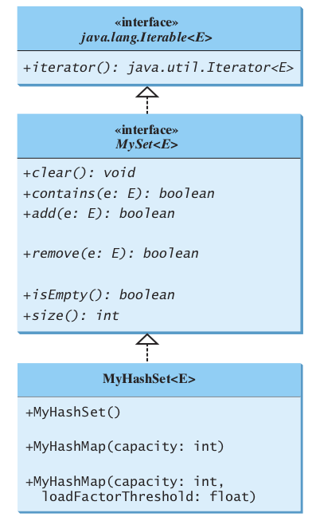

# Introduction

## Objectives

* To understand what hashing is and what hashing is used for (§27.2).
* To obtain the hash code for an object and design the hash function to
map a key to an index (§27.3).
*  To handle collisions using open addressing (§27.4).
*  To know the differences among linear probing, quadratic probing, and double hashing (§27.4).

## Objectives

* To handle collisions using separate chaining (§27.5).
* To understand the load factor and the need for rehashing (§27.6).
* To implement MyHashMap using hashing (§27.7).
* To implement MyHashSet using hashing (§27.8).

## Introduction

* Hashing is super efficient.
* It takes O(1) time to search, insert, and delete an element using hashing.

# 27.2 What is Hashing?

## What is hashing?

* Before introducing hashing, let us review map, which is a data structure that is implemented using hashing.
* Recall that a map (introduced in Section 21.5) is a container object that stores entries.
* Each entry contains two parts: a key and a value. The key, also called a search key, is used to search for the corresponding value.
* For example, a dictionary can be stored in a map, in which the words are the keys and the definitions of the words are the values.

## What is Hashing

{.stretch}

## Java Collections Framework

* The Java Collections Framework defines the java.util.Map interface for modeling maps.
* Three concrete implementations are java.util.HashMap, java.util.LinkedHashMap, and java.util.TreeMap.

## Java Collections Framework

* java.util.HashMap is implemented using hashing, java. util.LinkedHashMap using LinkedList, and java.util.TreeMap using red-black trees.
* In this lecture we will will learn the concept of hashing and use it to implement a hash map

# 27.3 Hash Functions and Codes

## Hash Functions and Codes

A typical hash function first converts a search key to an integer value called a hash code, then compresses the hash code into an index to the hash table.

## Hash Codes for Primitive Types

* To get the search keys for `byte`, `short`, `int`, and `char`, Java simply casts the variable to `int`
* Other types have more complicated means for calculating the hash code

## Hash Codes for Primitive Types

* For `float`, Java uses `Float.floatToIntBits(key)` as the hash code.
* This provides returns an int value whose bit representation is the same as the representation for the `float`.

## Java methods

* Java’s root class Object has the hashCode method, which returns an integer hash code.
* By default, the method returns the memory address for the object.
The general contract for the hashCode method is as follows:
1. You should override the hashCode method whenever the equals method is overridden to ensure that two equal objects return the same hash code.
2. During the execution of a program, invoking the hashCode method multiple times returns the same integer, provided that the object’s data are not changed.
3. Two unequal objects may have the same hash code, but you should implement the hashCode method to avoid too many such cases.

# 27.4 Handling Collisions Using Open Addressing

## Linear Probing

## Linear Probing

{.stretch}

## Linear Probing

[Demo](http://cs.armstrong.edu/liang/animation/web/LinearProbing.html)

## Quadratic Probing

{.stretch}

## Quadratic Probing

[Demo](http://cs.armstrong.edu/liang/animation/web/QuadraticProbing.html)

## Double Hashing

* Another open addressing scheme that avoids the clustering problem is known as double hash- ing.
* Starting from the initial index k, both linear probing and quadratic probing add an increment to k to define a search sequence.
* The increment is 1 for linear probing and j^2^ for quadratic probing.
* These increments are independent of the keys.
* Double hashing uses a secondary hash function h′(key) on the keys to determine the increments to avoid the clustering problem.

## Double Hashing

{.stretch}

## Double Hashing

* Specifically, double hashing looks at the cells at indices:

$(k + j* h′(key)) \% N$, for $j \ge 0$,
 that is:

 * $k\%N$
 * $(k + h′(key))\%N$
 * $(k + 2*h′(key))\%N$
 * $(k + 3*h′(key))\%N$
 * etc.

## Double Hashing Example

Given the following hash functions for a hash table of size 11:

$$h(key) = key \% 11; \\ h'(key) = 7 – key \% 7;$$

For a search key of 12, we have:

$$h(12) = 12 \% 11 = 1; \\ h'(12) = 7 - 12 \% 7 = 2;$$

## Double Hashing Example

Using the following double hash functions:
$$h(key) = key \% 11; \\ h'(key) = 7 – key \% 7;$$

Show the result of adding 45, 58, 4, 28, 21, and 12 to the hash table.

## Double Hashing

[Demo](https://liveexample.pearsoncmg.com/dsanimation/DoubleHashingeBook.html)

# 27.5 Handling Collisions Using Separate Chaining

## Separate Chaining

* The separate chaining scheme places all entries with the same hash index in the same location, rather than finding new locations.
* Each location in the separate chaining scheme uses a bucket to hold multiple entries.

## Separate Chaining

* You can implement a bucket using an array, ArrayList, or LinkedList.
* We will use LinkedList for demonstration.
* You can view each cell in the hash table as the reference to the head of a linked list, and elements in the linked list are chained starting from the head, as shown in the figure below

## Separate Chaining

{.stretch}

# 27.6 Load Factor and Rehashing

## Load Factor and Rehashing

* The load factor measures how full a hash table is.
* If the load factor is exceeded, increase the hash-table size and reload the entries into a new larger hash table.
* This is called rehashing.

# 27.7 Implementing a Map Using Hashing

## Implementing a Map Using Hashing

A map can be implemented using hashing.

## Implementing a Map Using Hashing

{.stretch}

## Implementing a Map Using Hashing

{.stretch}

## Implementing a Map Using Hashing

{.stretch}

# 27.8 Implementing Set Using Hashing

## Implementing Set Using Hashing

A hash set can be implemented using a hash map.

## Implementing Set Using Hashing

{.stretch}

# Summary

## Summary

1. A **map** is a data structure that stores entries. Each entry contains two parts: a **key** and a **value**. The key is also called a search key, which is used to search for the corresponding value. **You can implement a map to obtain O(1) time complexity on searching, retrieval, insertion, and deletion using the hashing technique.**
2. A **set** is a data structure that stores elements. **You can use the hashing technique to implement a set to achieve O(1) time complexity on searching, insertion, and deletion for a set.**

## Summary

3. **Hashing** is a technique that retrieves the value using the index obtained from a key without performing a search. A typical hash function first converts a search key to an integer value called a hash code, then compresses the hash code into an index to the hash table.
4. A **collision** occurs when two keys are mapped to the same index in a hashtable. Generally, there are two ways for handling collisions: open addressing and separate chaining.

## Summary

5. **Open addressing** is the process of finding an open location in the hashtable in the event of collision. Open addressing has several variations: linear probing, quadratic probing, and double hashing.
6. The **separate chaining** scheme places all entries with the same hash index into the same location, rather than finding new locations. Each location in the separate chaining scheme is called a bucket. A bucket is a container that holds multiple entries.
