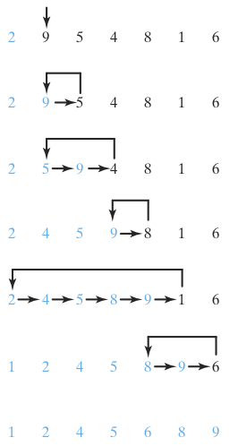
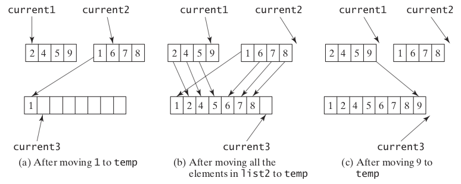
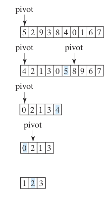
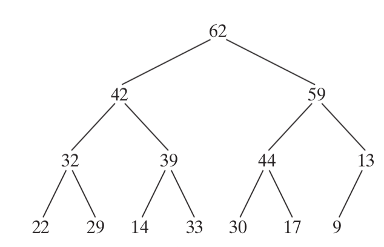

# Introduction

## Introduction

Sorting is a classic subject in computer science. There are three reasons to study sorting algorithms.

* First, sorting algorithms illustrate many creative approaches to problem solving, and these approaches can be applied to solve other problems.
* Second, sorting algorithms are good for practicing fundamental programming techniques using selection statements, loops, methods, and arrays.
* Third, sorting algorithms are excellent examples to demonstrate algorithm performance.

## Introduction

* Recall that selection sort has a time complexity of O(n^2^)
* Today we will look at another of other sorting algorithms
* You should become familiar with all of the algorithms and their time complexity

# Insertion Sort

## Insertion Sort

* The insertion-sort algorithm sorts a list of values by repeatedly inserting a new element into a sorted sublist until the whole list is sorted.

## Insertion Sort

{.stretch}

## Insertion Sort

```java
for (int i = 1; i < list.length; i++) {
     insert list[i] into a sorted sublist list[0..i-1] so that
     list[0..i] is sorted.
}
```

## Insertion Sort

```java
public static void insertionSort(double[] list) {
  for (int i = 1; i < list.length; i++) {
    double currentElement = list[i];
    int k;
    for (k = i - 1; k >= 0 && list[k] > currentElement; k--) {
      list[k + 1] = list[k];
    }
    list[k + 1] = currentElement;
  }
}
```

## Animation

[Animation](https://liveexample.pearsoncmg.com/liang/animation/web/InsertionSort.html)

## Insertion Sort Analysis

* The method is implemented with a nested for loop.
* The outer loop (with the loop control variable i) is iterated in order to obtain a sorted sublist, which ranges from list[0] to list[i].
* The inner loop (with the loop control variable k) inserts list[i] into the sublist from list[0] to list[i-1].


## Insertion Sort Analysis

* At the kth iteration, to insert an element into an array of size k, it takes up to k comparisions to find the insert position, and k moves to insert the number.  
* Let T(n) be the time complexity for insertion sort
* Let c denote the total number of other operations such as assignments and additional comparisons in each iterations

## Time Complexity

$$ \begin{aligned} T(n) &=(2+c)+(2*2+c)+ ... +(2*(n-1)+c) \end{aligned}$$


## Time Complexity

$$ \begin{aligned} T(n) &=(2+c)+(2*2+c)+ ... +(2*(n-1)+c) \\
&=2(1+2+ g+n-1)+c(n-1) \\
\end{aligned}$$

## Time Complexity

$$\begin{aligned} T(n) &=(2+c)+(2*2+c)+ ... +(2*(n-1)+c) \\
 &=2(1+2+ g+n-1)+c(n-1) \\
&=2\frac{(n-1)n}{2} +cn-c=n^2 -n+c \\
\end{aligned}$$

## Time Complexity

$$\begin{aligned} T(n) &=(2+c)+(2*2+c)+ ... +(2*(n-1)+c) \\
 &=2(1+2+ g+n-1)+c(n-1) \\
&=2\frac{(n-1)n}{2} +cn-c=n^2 -n+c \\
&= O(n^2) \\
\end{aligned}$$

## Time Complexity

* Therefore, the complexity of the insertion sort algorithm is O(n^2^).
* Hence, the selection sort and insertion sort are of the same time complexity.

# Bubble Sort (23.3)

## Bubble Sort

* A bubble sort sorts the array in multiple phases.
* Each pass successively swaps the neighboring elements if the elements are not in order.


## Algorithm

```
for (int k = 1; k < list.length; k++) {
  //Perform the kth pass
  for (int i = 0; i < list.length - k; i++) {
    if (list[i] > list[i + 1])
    swap list[i] with list[i + 1];
  }
}
```

## Bubble Sort

{.stretch}

## Algorithm Analysis

* Note that if no swap takes place in a pass, there is no need to perform the next pass, because all the elements are already sorted.
* If we check to see if any swaps take placed, then we can improve the algorithm


## Bubble Sort

```java
boolean needNextPass = true;
for (int k = 1; k < list.length; k++) {
  // Array may be sorted and next pass not needed
  needNextPass = false;
  // Perform the kth pass
  for (int i = 0; i < list.length – k; i++) {
    if (list[i] > list[i + 1]) {
        swap list[i] with list[i + 1];
        needNextPass = true; // Next pass still needed
        // Perform the kth pass
        for (int i = 0; i < list.length - k; i++) {
          if (list[i] > list[i + 1])
            swap list[i] with list[i + 1];
```

## Bubble Sort Animation

[Animation](https://liveexample.pearsoncmg.com/liang/animation/web/BubbleSort.html)

## Algorithm Analysis

* In the best case, the bubble sort algorithm needs just the first pass to find that the array is already sorted—no next pass is needed.
* Since the number of comparisons is n - 1 in the first pass, the best-case time for a bubble sort is O(n).

## Algorithm Analysis

* In the worst case, the bubble sort algorithm requires n - 1 passes.
  * The first pass makes n - 1 comparisons;
  * the second pass makes n - 2 comparisons; and so on;
  * the last pass makes 1 comparison.
* Can you write an equation (T(n)) for the total number of comparisons?

## Time Complexity

$$\begin{aligned} T(n) = (n - 1) + (n-2) + ... + 2 + 1 \\
\end{aligned}$$


## Time Complexity

$$\begin{aligned} T(n) &= (n - 1) + (n-2) + ... + 2 + 1 \\
&=\frac{(n-1)n}{2} = \frac{n^2}{2} - \frac{n}{2} \\
&= O(?) \\
\end{aligned}$$

## Time Complexity

$$\begin{aligned} T(n) &= (n - 1) + (n-2) + ... + 2 + 1 \\
&=\frac{(n-1)n}{2} = \frac{n^2}{2} - \frac{n}{2} \\
&= O(n^2) \\
\end{aligned}$$


## Time Complexity

* The worst-case time for a bubble sort is O(n^2^)
* This is the same as selection sort and insertion sort.

# Merge Sort

## Merge Sort

* The merge sort algorithm can be described recursively as follows:
* The algorithm divides the array into two halves and applies a merge sort on each half recursively.
* After the two halves are sorted, merge them.

## Merge Sort

{.stretch}

## Merge Sort

```java
public static void mergeSort(int[] list) {
  if (list.length > 1) {
    mergeSort(list[0 ... list.length / 2]);
    mergeSort(list[0 ... list.length / 2]);
    merge list[0 ... list.length / 2] with
      list[list.length / 2 + 1 ... list.length];
  }
}
```

## Merge Sort - Merge

{.stretch}


## Merge Sort Animation

* [Animation](https://liveexample.pearsoncmg.com/liang/animation/web/MergeList.html)

## Time Complexity

* Let T(n) denote the time required for sorting an array of n elements using a merge sort.
* Without loss of generality, assume that n is a power of 2

$$ T(n) = T(\frac{n}{2}) + T(\frac{n}{2}) + mergetime$$

## Time Complexity

* To merge two subarrays, it takes at most n-1 comparisons to compare the elements from the two subarrays and n moves to move elements to the temporary array.  Thus, the total time is 2n - 1
* Therefore

$$ \begin{aligned}  T(n) &= T(\frac{n}{2}) + T(\frac{n}{2}) + 2n-1 \\
&= O(?)\end{aligned}$$

## Time Complexity

* To merge two subarrays, it takes at most n-1 comparisons to compare the elements from the two subarrays and n moves to move elements to the temporary array.  Thus, the total time is 2n - 1
* Therefore

$$ \begin{aligned}  T(n) &= T(\frac{n}{2}) + T(\frac{n}{2}) + 2n-1 \\
&= O(n \log n)\end{aligned}$$

## Time Complexity

* Thus complexity of a merge sort is O(n log n).
* This algorithm is better than selection sort, insertion sort, and bubble sort, because the time complexity of these algorithms is O(n^2^).
 * The sort method in the java.util.Arrays class is implemented using a variation of the merge sort algorithm.


# Quick Sort

## Quick Sort

A quick sort works as follows:

* The algorithm selects an element, called the pivot, in the array.
* It divides the array into two parts, so that all the elements in the first part are less than or equal to the pivot and all the elements in the second part are greater than the pivot.
* The quick sort algorithm is then recursively applied to the first part and then the second part.

## Quick Start

{.stretch}

## Quick Sort

```
public static void quickSort(int[] list) {
    if (list.length > 1) {
      select a pivot;
      partition list into list1 and list2 such that all elements in list1 <= pivot and all elements in list2 > pivot
      quickSort(list1);
      quickSort(list2);
    }
}
```

## Time Complexity

### Best Case

In the best case, the pivot divides the array each time into two parts of about the same size. Let T(n) denote the time required for sorting an array of n elements using quick sort. Thus,

$$T(n) = T(\frac{n}{2}) + T(\frac{n}{2}) + n$$

Similar to the merge sort analysis, T(n) = O ( n log n)

## Time Complexity

### Average Case

On average, pivot will not divide the array into two parts of the same size or one empty part each time.  Statistically, the sizes of the two parts are very close.  Therefore, the average time is still O ( n log n).


## Quick Sort vs. Merge Sort

* Both merge sort and quick sort employ the divide-and-conquer approach.
* For merge sort, the bulk of the work is to merge two sublists, which takes place after the sublists are sorted.
* For quick sort, the bulk of the work is to partition the list into two sublists, which takes place before the sublists are sorted.
* Merge sort is more efficient than quick sort in the worst case, but the two are equally efficient in the average case.
* Merge sort requires a temporary array for sorting two subarrays.
* Quick sort does not need additional array space.
* Thus, quick sort is more space efficient than merge sort.

# Heap Sort

## Heap Sort

A heap sort uses a binary heap. It first adds all the elements to a heap and then removes the largest elements successively to obtain a sorted list.

## Heap Example

{.stretch}

## Heap Example

{.stretch}

## Adding a Node

```
Let the last node be the current node;
while (the current node is greater than its parent) {
    Swap the current node with its parent;
    Now the current node is one level up;
}
```

## Removing a Node

```
Move the last node to replace the root;
Let the root be the current node;
while (the current node has children and the current node is          smaller than one of its children) {
    Swap the current node with the larger of its children;
        Now the current node is one level down;
}
```

## Heap Class Demo

## Time Complexity

the total time for producing a sorted array from a heap is O(n logn).

## Animations


* https://liveexample.pearsoncmg.com/liang/animation/web/InsertionSort.html
* https://liveexample.pearsoncmg.com/liang/animation/web/BubbleSort.html
* https://liveexample.pearsoncmg.com/liang/animation/web/MergeList.html

# Bucket and Radix Sorts

## Bucket and Radix Sorts

Bucket sorts and radix sorts are efficient for sorting integers.

## Bucket

## Radix

## Time Complexity

* Radix sort takes O(dn) time to sort n elements with integer keys, where d is the maximum
