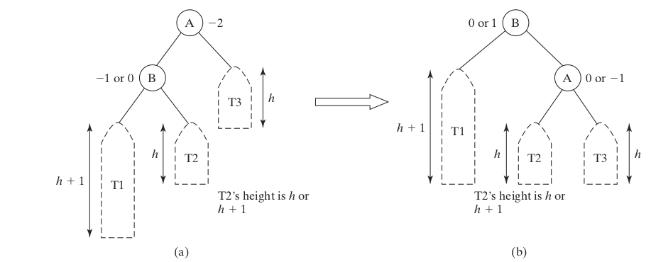
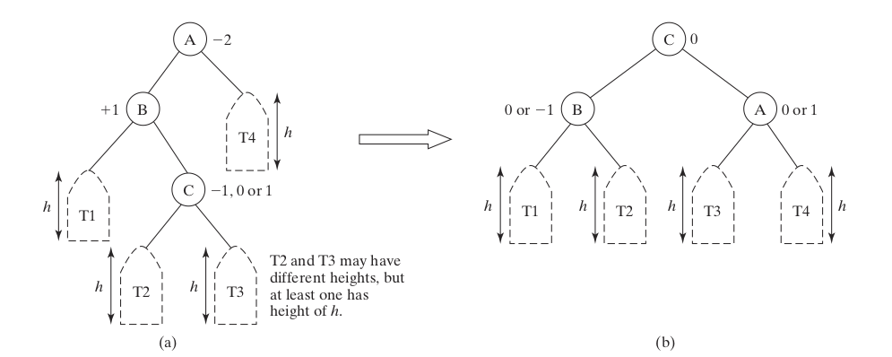
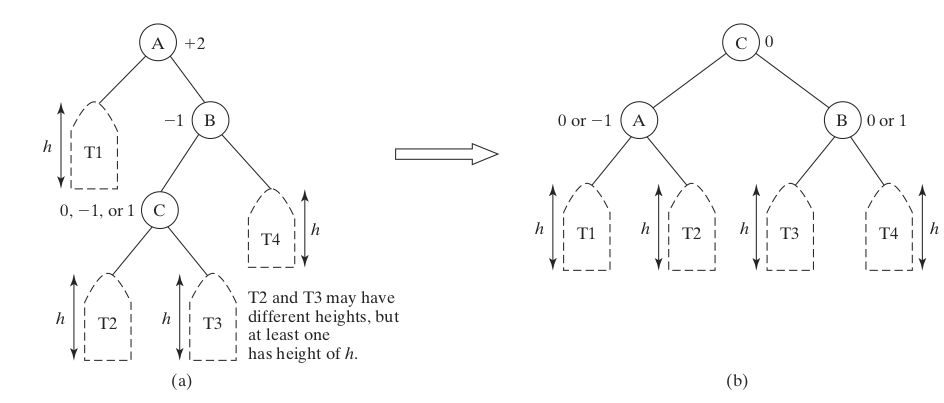
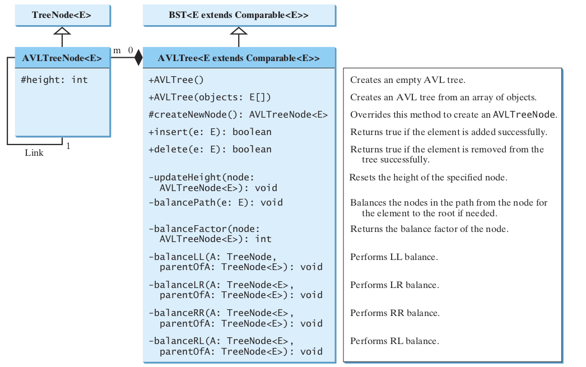
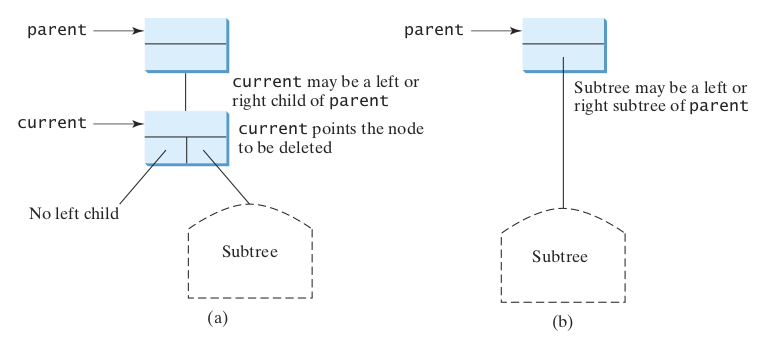

# Introduction

## Objectives

* To know what an AVL tree is (§26.1).
* To understand how to rebalance a tree using the LL rotation,
LR rotation, RR rotation, and RL rotation (§26.2).
* To design the AVLTree class by extending the BST class (§26.3).
* To insert elements into an AVL tree (§26.4).
## Objectives

* To implement tree rebalancing (§26.5).
* To delete elements from an AVL tree (§26.6).
* To implement the AVLTree class (§26.7).
* To test the AVLTree class (§26.8).
* To analyze the complexity of search, insertion, and deletion operations in AVL trees (§26.9).

## Motivation

* Chapter 25 introduced binary search trees.
* The search, insertion, and deletion times for a binary tree depend on the height of the tree.
* In the worst case, the height is O(n). If a tree is perfectly balanced–i.e., a complete binary tree—its height is log n.
* Can we maintain a perfectly balanced tree? Yes, but doing so will be costly.
* The compromise is to maintain a well-balanced tree—that is, the heights of every node’s two subtrees are about the same.

## History

* AVL trees were invented in 1962 by two Russian computer scientists, G. M. Adelson-Velsky and E. M. Landis
* Thus, they are named AVL Trees

## Overview

* In an AVL tree, the difference between the heights of every node’s two subtrees is 0 or 1.
* It can be shown that the maximum height of an AVL tree is O(log n).

## Balance

* The process for inserting or deleting an element in an AVL tree is the same as in a regular binary search tree, except that you may have to rebalance the tree after an insertion or deletion operation.
* The **balance factor** of a node is the height of its right subtree minus the height of its left subtree.
* A node is said to be balanced if its balance factor is -1, 0, or 1. A node is considered left-heavy if its balance factor is -1, and right-heavy if its balance factor is +1.

## Balance

What is the balance of each need in these trees?

{.stretch}

# Rebalancing Trees (26.2)

## Rebalancing

### Key Point
After inserting or deleting an element from an AVL tree, if the tree becomes unbalanced, perform a rotation operation to rebalance the tree.

## Rebalancing

* If a node is not balanced after an insertion or deletion operation, you need to rebalance it.
* The process of rebalancing a node is called rotation.
* There are four possible rotations: LL, RR, LR, and RL.

## LL Imbalance and Rotation

* An LL imbalance occurs at a node A, such that A has a balance factor of -2 and a left child B with a balance factor of -1 or 0
* This type of imbalance can be fixed by performing a single right rotation at A, as shown in the figure below.

## LL Imbalance and Rotation

{.stretch}

## RR Imbalance and Rotation

* An RR imbalance occurs at a node A, such that A has a balance factor of +2 and a right child B with a balance factor of +1 or 0
* This type of imbalance can be fixed by performing a single left rotation at A, as shown in the figure below.

## RR Imbalance and Rotation

{.stretch}

## LR Imbalance and Rotation

* An LR imbalance occurs at a node A, such that A has a balance factor of -2 and a left child B with a balance factor of +1
  - Assume B’s right child is C. This type of imbalance can be fixed by performing a double rotation (first a single left rotation at B and then a single right rotation at A), as shown in the figure below.

## LR Imbalance and Rotation

{.stretch}

## RL Imbalance and Rotation

* An RL imbalance occurs at a node A, such that A has a balance factor of +2 and a right child B with a balance factor of -1
* Assume B’s left child is C.
* This type of imbalance can be fixed by performing a double rotation (first a single right rotation at B and then a single left rotation at A), as shown in the figure below.

## RL Imbalance and Rotation

{.stretch}

# Designing Classes for an AVL Tree (26.3)

## Implementation

* Since an AVL tree is a binary search tree, AVLTree is designed as a subclass of BST.

## Implementation

{.stretch}

# Overriding the `insert` method

## Overriding `insert`

* Inserting an element into an AVL tree is the same as inserting it to a BST, except that the tree may need to be rebalanced.
* A new element is always inserted as a leaf node.
* As a result of adding a new node, the heights of the new leaf node’s ancestors may increase.
* After inserting a new node, check the nodes along the path from the new leaf node up to the root.
* If an unbalanced node is found, perform an appropriate rotation using the algorithm

## Overriding `insert`

```java
@Override /** Insert an element and rebalance if necessary */
public boolean insert(E e) {
  boolean successful = super.insert(e);
  if (!successful)
    return false; // e is already in the tree
  else {
    balancePath(e); // Balance from e to the root if necessary
  }
  return true; // e is inserted
}
```

## `balancePath` method

```java
private void balancePath(E e) {
    java.util.ArrayList<TreeNode<E>> path = path(e);
    for (int i = path.size() - 1; i >= 0; i--) {
      AVLTreeNode<E> A = (AVLTreeNode<E>)(path.get(i));
      updateHeight(A);
      AVLTreeNode<E> parentOfA = (A == root) ? null :
        (AVLTreeNode<E>)(path.get(i - 1));
        switch (balanceFactor(A)) {
          case -2:
            if (balanceFactor((AVLTreeNode<E>)A.left) <= 0) {
              balanceLL(A, parentOfA); // Perform LL rotation
            }

```

## `balancePath` method

```java
        else {
          balanceLR(A, parentOfA); // Perform LR rotation
        }
        break;
      case +2:
        if (balanceFactor((AVLTreeNode<E>)A.right) >= 0) {
          balanceRR(A, parentOfA); // Perform RR rotation
        }
        else {
          balanceRL(A, parentOfA); // Perform RL rotation
        }
    }
  }
}
```

## Checkpoint


## Checkpoint


## Checkpoint


# Implementing Rotations

## Implementing Rotations

### Key Point

An unbalanced tree becomes balanced by performing an appropriate rotation operation.

## LL Rotation {.tinyslide}

```java
/** Balance LL (see Figure 27.1) */
  private void balanceLL(TreeNode<E> A, TreeNode<E> parentOfA) {
    TreeNode<E> B = A.left; // A is left-heavy and B is left-heavy

    if (A == root) {
      root = B;
    }
    else {
      if (parentOfA.left == A) {
        parentOfA.left = B;
      }
      else {
        parentOfA.right = B;
      }
    }

    A.left = B.right; // Make T2 the left subtree of A
    B.right = A; // Make A the left child of B
    updateHeight((AVLTreeNode<E>)A);
    updateHeight((AVLTreeNode<E>)B);
  }
  ```

# Implementing `delete`

## Implementing `delete`

### Key Point

Deleting an element from an AVL tree is the same as deleing it from a BST, except that the tree may need to be rebalanced.

## Deletion

There are two possible cases with different algorithms for deletion:

* If the deleted has no left child
* If the deletd node has a left child

## Deletion Without Left Child

{.stetch}

## Deletion Without Left Child

* When this deletion happens, the height of the nodes from the parent node up to the root may have decreased
* Therefore, we must call `balancePath(parent.element)`

## Deleting With Left Child

{.stretch}

## Deleting With Left Child

* When this deletion happens, the height of the nodes along the path from `parentOfMostRight` may change.  
* Therefore, we must call `balancePath(parentOfRightMost)`

# `AVLTree` Class

# AVL Tree Time Complexity

## AVL Tree Time Complexity

### Key Point

Since the height of an AVL tree is O(log n), the time complexity of the search, insert, and delete methods in AVLTree is O(log n).

## AVL Tree Time Complexity

* The time complexity of the search, insert, and delete methods in AVLTree depends on the height of the tree.
* We can prove that the height of the tree is O(log n).


## AVL Tree Time Complexity

* Let G(h) denote the minimum number of the nodes in an AVL tree with height h.
* G(1) is 1 and G(2) is 2.
* The minimum number of nodes in an AVL tree with height h >= 3 must have two minimum subtrees: one with height h - 1 and the other with height h - 2.
* Thus $$G(h) = G(h-1) + G (h-2) + 1$$

## AVL Tree Time Complexity

* Recall that a Fibonacci number at index i can be described using the recurrence relation F(i) = F(i - 1) + F(i - 2).
* Therefore, the function G(h) is essentially the same as F(i).
* It can be proven that
$$h < 1.4405\ log(n + 2) - 1.3277$$
* Hence, the height of an AVL tree is O(log n)

## AVL Tree Time Complexity

* The search, insert, and delete methods involve only the nodes along a path in the tree.
* The updateHeight and balanceFactor methods are executed in a constant time for each node in the path.
* The balancePath method is executed in a constant time for a node in the
path.
* Thus, the time complexity for the search, insert, and delete methods is O(log n).
