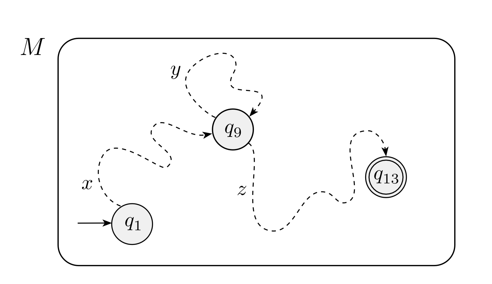

# Roadmap for Lecture 

* Review Regular Expressions
* Motivate the Pumping Lemma
* Present and demonstrate the pumping lemma concept
* Present and prove the pumping lemma
* Use the pumping lemma to prove some languages are not regular

# Review 

* In the previous lecture we introduced a new theorem:
* **Theorem 1.54** A language is regular if and only if some regular expression describes it.
* We showed that this theorem must be proved in both directions:
    * **Lemma 1.55** If a language is described by a regular expression, then it is regular.
    * **Lemma 1.60** If a language is regular, then it is described by a regular expression.

# Review 

1. Motivated and defined regular expressions as
    a more concise and elegant method to
    represent **Regular Languages**.
2. Proved that FAs (Deterministic as well as
    Nondeterministic) and REs is identical by:
    1. Defining GNFAs.
    2. Showing how to convert a DFA to a GNFA.
    3. Showing an algorithm to converted a
        * GNFA with K states to an equivalent
        * GNFA with K-1 states.

# Non-Regular Langauges

# Introduction

* In this lecture we ask: are all languages regular?
* The answer is... no
* The simplest example is the language:

$$B = \{a^nb^n | n \geq 0 \}$$

# Introduction

* If we try to find a DFA that recognizes the language $B = \{a^nb^n | n \geq 0 \}$, it seems that we need an infinite number of states, to “remember” how many *a*s we saw so far.
* Note: This is not a proof!
* Perhaps a DFA recognizing B exists, but we are not clever enough to find it?

# Introduction

* The Pumping Lemma is the formal tool we use to prove that the language B (as well as many other languages) is not regular.

# What is Pumping?

* Consider the following NFA N
* It accepts all words of the form $(0 \cup 1)(10)^*$

```dot
digraph{
    rankdir=LR;

    qs[style="invis"];
    q0[label=<q<SUB>0</SUB>> shape="circle"];
    q1[label=<q<SUB>1</SUB>> shape="doublecircle"];
    q2[label=<q<SUB>2</SUB>> shape="circle"];
    q3[label=<q<SUB>3</SUB>> shape="doublecircle"];

    qs->q0;
    q0->q1[label="0,1"];
    q1->q2[label="1"];
    q2->q3[label="0"];
    q3->q1[label="E"]
}

```

# What is Pumping?

* Consider now the word $110 \in L(N)$
* Pumping means the word 110 can be divided into two parts: 1 and 10, such that for any $i \geq 0$, the word $1(10)^i \in L(n)$
* We say that the word 110 can be **pumped**
* For $i = 0$ this is called **down pumping**
* For $i > 1$ this is called **up pumping** 

# What is Pumping?

* A more general description would be:
* A word $w \in L$, can be pumped if $w = xy$ and for each $i \geq 0$, it holds that $xy^i \in L$
* The formal definition is a little more complex than this

# The Pumping Lemma 

$$
\text{If A is a regular language and } \\ \exists p = \text{ the number of states in any machine for A }. \\
\forall w \text{ in A where } |w| \geq p \\ 
\exists x,y,z \text{ where } w = xyz, |y| > 0, |xy| \leq p \\
\forall i > 0, xy^iz \in A 
$$ 

# Contrapositive

$$
\forall p = \text{ the number of states in any machine for A }. \\
\exists w \text{ in A  where } |w| \geq p \\ 
\forall x,y,z \text{ where } w = xyz, |y| > 0, |xy| \leq p \\
\exists i > 0, xy^iz \notin A 
$$ 

# Proof of the PL

* Let D be a DFA recognizing A and let p be the number of states of D. 
* If A has no words whose length is at least p, the theorem holds vacuously. 
* Let $w \in A$ be an arbitrary word such that $| w |\geq p$
* Denote the symbols of w by $w=w_1,w_2,...,w_m$ where $m=|w| \geq p$

# Proof of the PL

* Assume that $q_0,q_1,...,q_k$ is the sequence of states that D goes through while computing with input w.
* For each $k, 0 \leq k < m, \delta(q_k,w_k)=q_{k+1}$, since $w \in A,q_m \in F_D$
* Since the sequence $q_0,q_1,...,q_p$ contains $p + 1$ states and since the number of states of D is
$p$, that there exist two indices $0 \leq i < j \leq p$,
such that $q_j =q_i$ .

# Proof of the PL

* Denote $x=w_1,w_2,...,w_{i-1}, y=w_i,w_{i+1},...,w_{j-1} ..., z=w_j,w_{j+1},...,w_m$ 
* Note: Under this definition $| y |> 0$ and $| xy | \leq p$ . 
* By this definition, the computation of D on $x=w_1,w_2,...,w_{i-1}$ starting from $q_0$, ends at $q_i$. 
* By this definition, the computation of D on $z=w_j,w_{j+1},...,w_{m}$ ,starting from $q_j$ ,ends at $q_m$ which is an accepting state

# Proof of the PL

* The computation of D on $y=w_j,w_{j+1},...,w_{m}$ starting from $q_i$, ends at $q_j$
* Since $q_i=q_j$, this computation starts and ends at the same state.
* Since it is a circular computation, it can repeat itself *k* times for any $k \geq 0$
* In other words: for each $i \geq 0$, $xy^iz \in A$
* Q.E.D.

# Review

# References, Resources

* [ADUni.org Lectures](https://www.youtube.com/playlist?list=PL601FC994BDD963E4)
* [UC San Diego Lecture Slides](https://cseweb.ucsd.edu/classes/fa08/cse105/)