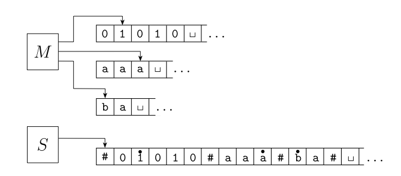
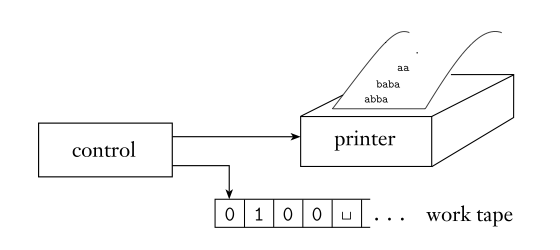

# Introduction

## Variants of Turing Machines

* Alternative definitions of Turing machines abound, including versions with multiple tapes or with nondeterminism.
* They are called variants of the Turing machine model.
* The original model and its reasonable variants all have the same power—they recognize the same class of languages.

# Multitape Turing Machine

## Multitape Turing Machine

* A multitape Turing machine is like an ordinary Turing machine with several tapes.
* Each tape has its own head for reading and writing.
* Initially the input appears on tape 1, and the others start out blank.
* The transition function is changed to allow for reading, writing, and moving the heads on some or all of the tapes simultaneously.

## Theorems

### Theorem 3.13

Every multitape Turing machine has an equivalent single-tape Turing machine.

### Corollary 3.15

A language is Turing-recognizable if and only if some multitape Turing machine recognizes it.

## Multitape Turing Machine Equivalence

# Nondeterministic Turing Machines

## Nondeterministic Turing Machines

* A nondeterministic Turing machine is defined in the expected way.
* At any point in a computation, the machine may proceed according to several possibilities.
* The transition function for a nondeterministic Turing machine has the form:

$$δ : Q × Γ \longrightarrow P ( Q × Γ × { L , R } )$$

## Nondeterministic Turing Machines

* The computation of a nondeterministic Turing machine is a tree whose branches correspond to different possibilities for the machine.
* If some branch of the computation leads to the accept state, the machine accepts its input.

## Theorem 3.16

Every nondeterministic Turing machine has an equivalent deterministic Turing
machine.

## Nondeterministic TM Equivalence

## Corollaries

### Corollary 3.18

A language is Turing-recognizable if and only if some nondeterministic Turing machine recognizes it.

### Corollary 3.19

A language is decidable if and only if some nondeterministic Turing machine
decides it.

# Enumerators

## Enumerators

* As we mentioned earlier, some people use the term recursively enumerable language for Turing-recognizable language.
* That term originates from a type of Turing machine variant called an enumerator.
* Loosely defined, an enumerator is a Turing machine with an attached printer.
* The Turing machine can use that printer as an output device to print strings.
* Every time the Turing machine wants to add a string to the list, it sends the string to the printer.

## Enumerator

## Enumerator

* An enumerator E starts with a blank input on its work tape.
* If the enumerator doesn’t halt, it may print an infinite list of strings.
* The language enumerated by E is the collection of all the strings that it eventually prints out.
* Moreover, E may generate the strings of the language in any order, possibly with repetitions.

## Theorem 3.21

A language is Turing-recognizable if and only if some enumerator enumerates it.

## Equivalence with Other Models

* So far we have presented several variants of the Turing machine model and have shown them to be equivalent in power.
* Many other models of general purpose computation have been proposed.
* Some of these models are very much like Turing machines, but others are quite different.

## Equivalence with Other Models

* All share the essential feature of Turing machines—namely, unrestricted access to unlimited memory— distinguishing them from weaker models such as finite automata and pushdown automata.
* Remarkably, all models with that feature turn out to be equivalent in power, so long as they satisfy reasonable requirements.

# The Definition of Algorithm

## The Definition of Algorithm

* Informally speaking, an algorithm is a collection of simple instructions for car- rying out some task.
* Commonplace in everyday life, algorithms sometimes are called procedures or recipes. * Algorithms also play an important role in mathematics.
* Ancient mathematical literature contains descriptions of algorithms for a variety of tasks, such as finding prime numbers and greatest common divisors.
* In contemporary mathematics, algorithms abound.

## The Church-Turing Thesis

* A formal definition of an algorithm came in the 1936 papers of Alonzo Church and Alan Turing.
* Church used a notational system called the λ-calculus to define algorithms.
* Turing did it with his “machines.”
* These two definitions were shown to be equivalent.
* This connection between the informal notion of algorithm and the precise definition has come to be called the Church–Turing thesis.

## The Church-Turing Thesis

* The Church-Turing Thesis tells us that the intuitive notion of algorithms is equivalent to Turing machine algorithms

## Terminology for Describing Turing Machines

* We continue to speak of Turing machines, but our real focus from now on is on algorithms.
* That is, the Turing machine merely serves as a precise model for the definition of algorithm.
* We may skip over the extensive theory of Turing machines themselves and not spend much time on the low-level programming of Turing machines.
* We need only to be comfortable enough with Turing machines to believe that they capture all algorithms.

## Terminology for Describing Turing Machines

There are three possibilities for how to describe Turing machines:

1. The first is the formal description that spells out in full the Turing machine’s states, transition function, and so on. It is the lowest, most detailed level of description.
2. The second is a higher level of description, called the implementation description, in which we use English prose to describe the way that the Turing machine moves its head and the way that it stores data on its tape. At this level we do not give details of states or transition function.
3. The third is the high-level description, wherein we use English prose to describe an algorithm, ignoring the implementation details. At this level we do not need to mention how the machine manages its tape or head.
